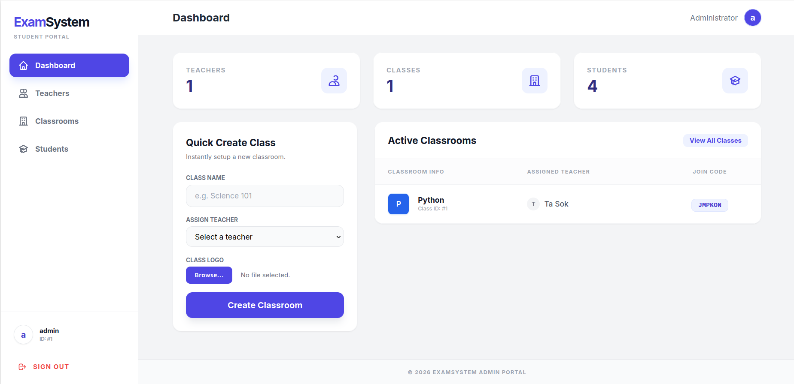

# Online Examination System

<p align="center">
    <a href="https://online-examination-system-na0j.onrender.com" target="_blank">
        
    </a>
</p>

A comprehensive web-based examination platform built with **Laravel 10**, featuring role-based access control for Admins, Teachers, and Students. The system allows for streamlined exam creation, real-time assessment, and automated grading.

## 🚀 Features

### 🎓 Student Portal
- **Dashboard**: Overview of active and missed exams.
- **Take Exams**: Real-time timed assessments with a secure interface.
- **Exam History**: View past results, scores, and feedback.
- **Profile Management**: Update personal information and profile picture.
- **Safety**: Confirmation modals for starting and submitting exams to prevent accidental actions.

### 👨‍🏫 Teacher Portal
- **Class Management**: Organize students into classes.
- **Exam Creation**: Create exams with multiple-choice questions.
- **Question Bank**: Manage and reuse questions across exams.
- **Grading**: Automated scoring and grade tracking.
- **Student Performance**: View detailed reports on student progress.

### 🛡️ Admin Portal
- **User Management**: Manage Teacher and Student accounts.
- **System Configuration**: Global settings and oversight.
- **Class Oversight**: Monitor all classes and assignments.

## 🛠️ Tech Stack

- **Backend**: [Laravel 10](https://laravel.com) (PHP 8.1+)
- **Frontend**: [Blade Templates](https://laravel.com/docs/blade), [Tailwind CSS](https://tailwindcss.com), [Alpine.js](https://alpinejs.dev)
- **Asset Bundling**: [Vite](https://vitejs.dev)
- **Database**: MySQL
- **Authentication**: Laravel Sanctum & Fortify (Role-based middleware)
- **File Storage**: Cloudinary Integration
- **Mail**: Brevo Mailer

## ⚙️ Installation

1. **Clone the repository**
   ```bash
   git clone https://github.com/MonMakara/online-examination-system.git
   cd online-examination-system
   ```

2. **Install PHP dependencies**
   ```bash
   composer install
   ```

3. **Install NPM dependencies**
   ```bash
   npm install
   ```

4. **Environment Setup**
   Copy the example environment file and configure your database and API keys (Cloudinary, Brevo, etc.).
   ```bash
   cp .env.example .env
   php artisan key:generate
   ```

5. **Database Migration**
   ```bash
   php artisan migrate
   ```

6. **Serve the Application**
   Start the development server:
   ```bash
   php artisan serve
   ```
   In a separate terminal, compile assets:
   ```bash
   npm run dev
   ```

## 📸 Screenshots



## 🤝 Contributing

Contributions are welcome! Please fork the repository and submit a pull request for any enhancements.

## 📄 License

Copyright © 2026 **MonMakara**. All Rights Reserved.
